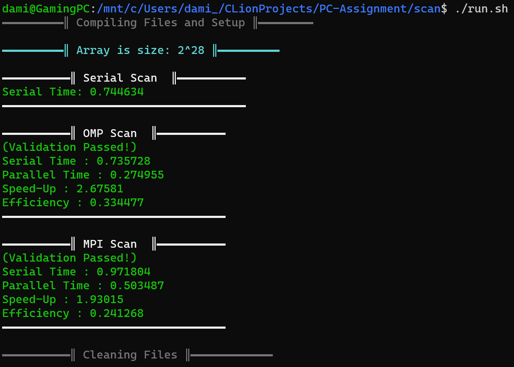
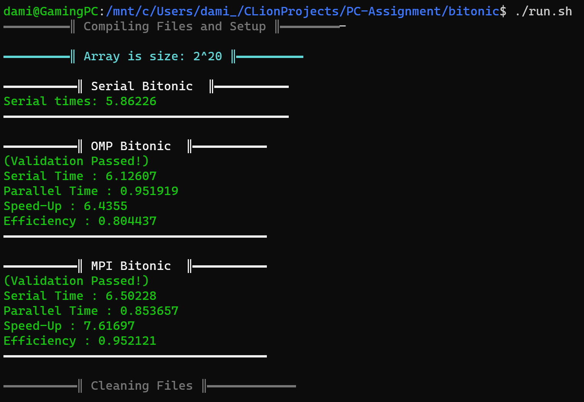
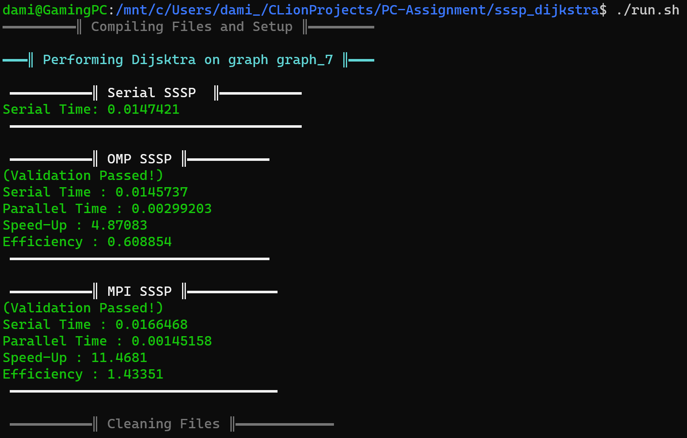

# Parallel Computing Assignment COMS3008A

### 2303289, Damion Harvey&nbsp;&nbsp;&nbsp;&nbsp;&nbsp;&nbsp;&nbsp;&nbsp;&nbsp;&nbsp;2302891, Wen Guan Gavin Chen

<!-- TOC -->

## Table of Contents:
* [How to run & compile:](#how-to-run--compile-)
* [Editing the number of cores and input size:](#editing-the-number-of-cores-and-input-size-)
    * [Editing the input size or graph](#editing-the-input-size-or-graph)
    * [Editing number of cores](#editing-number-of-cores)
* [Project File Structure is as follows:](#project-file-structure-is-as-follows-)
    * [Other information:](#other-information-)
* [Examples of output for the separate collection of programs:](#examples-of-output-for-the-separate-collection-of-programs-)
    * [Scan Example:](#scan-example-)
    * [Bitonic Example:](#bitonic-example-)
    * [SSSP Example:](#sssp-example-)

<!-- TOC -->

## How to run & compile:

Each program is set up in its own folder (ie, scan, sssp_dijsktra, bitonic). Using a bash terminal, cd into the desired
directory using the `cd` command - eg (`cd scan`) which them puts you into the directory of the scan program.

The provided shell file for each program (run.sh - executed via `./run.sh`) will compile
all 3 implementations, and then will run all 3 files (displaying the useful info to the screen)
and will then discard the executables.

The user does not need to manually run the makefile, though this is still possible if each file wants to be tested
manually or individually.

Please ensure to have the correct version of g++, OpenMP, and OpenMPI installed
(versions used for development are listed below).

*Please see examples at the bottom of the readme of running the different programs & output of each*

## Editing the number of cores and input size:

As stated above, each programs folder containts a `run.sh` file. Within this file there are some properties.

### Editing the input size or graph

For Scan and Bitonic, at the top of the `run.sh`, 2 variables can be found: `ARRAY_SIZE` and `MPI_CORES`.
Setting the array size variable allows the user to edit the array size the programs are run on. Pleae note,
this array size is a power of 2, so inputting `ARRAY_SIZE=22` will set the input size to be 2<sup>22</sup> and not just
22  
Please note the bounds for this implementation is `3 ≤ ARRAY_SIZE ≤ 28`. Please ensure the lower bound is greater than
or equal to the number of cores. In this case, where 2<sup>3</sup> ≥ P. 

In the case of Dijsktra, where each implementation reads in a graph text file, there is a variable at the top of
each `run.sh` file, namely `GRAPH`. Setting this to be any graph inside the directory allows you to run the
implementation
on that graph. For example, `GRAPH=graph_5` will run dijsktra on the given graph 5. Please note that the only valid
graph
inputs are those in the range `graph_0, graph_1, ..., graph_7`. Please also ensure that the number of vertices in the
graph are atleast
as many as the number of cores else the algorithm will not run. IE, running graph_0 (which contains 6 vertices)
on a run with 16 cores will be invalid.

### Editing number of cores

Again, in each `run.sh` there is a `MPI_CORES` variable at the top of the file (this applies to all 3 implementations).
Setting this value to the desired cores allows you to edit the number of cores for the MPI implementation.

In order to change the number of cores for the OMP implementation, please open the specific OMP
implementation `xxx_omp.cpp` file
and set the constant near the top of the file:
```c++ 
#define NUMTHREADS = P
```
Where `P` is the desired number of cores. Please also
ensure to choose a value for P in the range: `2, 4, 8, 16, ...` in order to best fit each implementation.

## Project File Structure is as follows:
```
PC-Assignment
│   README.pdf
│   report_2303289_2302891.pdf
│
└───scan
│   │   makefile
│   │   run.sh
│   │   scan.cpp
│   │   scan_omp.cpp
│   │   scan_mpi.cpp
│   
│   
└───sssp_dijsktra
│   └───graphs
│   │   makefile
│   │   run.sh
│   │   sssp.cpp  
│   │   sssp_omp.cpp      
│   │   sssp_mpi.cpp     
│
│  
└───bitonic
│   │   makefile
│   │   run.sh
│   │   bitonic.cpp  
│   │   bitonic_omp.cpp      
│   │   bitonic_mpi.cpp   
```

### Other information:

All files were written using the C++11 standard. Files were all compiled using the following versions:

|    SOFTWARE    |          VERSION          |
|:--------------:|:-------------------------:|
| **Ubuntu WSL** |      Ubuntu1 20.04.1      |
|    **g++**     |     g++ Ubuntu 9.4.0      |
|   **OpenMP**   | (bundled with Ubuntu g++) |
|  **OpenMPI**   |        OMPI 4.0.3         |

## Examples of output for the separate collection of programs:

### Scan Example:
```
cd scan
./run.sh
```


### Bitonic Example:
```
cd bitonic
./run.sh
```

  
### SSSP Example:
```
cd sssp_dijkstra
./run.sh
```
  
  
